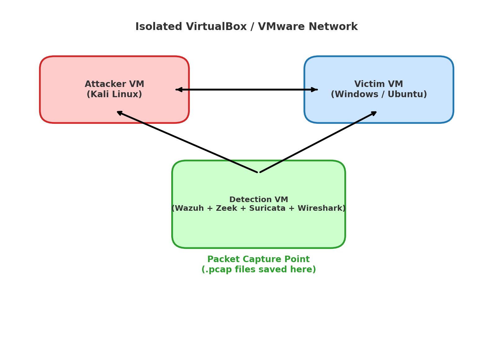

# 🛡️ SOC Lab & Packet Capturing Project

---

## 📌 Project Overview
A complete SOC lab project demonstrating packet capturing, PCAP analysis, Sigma detection engineering, and SIEM integration using **Wazuh**, **Zeek**, **Suricata**, and **Wireshark**.

---

## 🖼 SOC Lab Architecture

---

## 📸 Project Screenshots *(coming soon)*

### 1. Wireshark PCAP Analysis

### 2. Zeek Connection Logs

### 3. Suricata IDS Alerts

### 4. Wazuh SIEM Dashboard

> 📌 **Tip**: Just add your screenshots into the `screenshots/` folder with these filenames, and they’ll automatically appear here.

---

## 🛠 Sigma Detection Rules
- **Nmap Scan Detection** → `sigma_rules/nmap_scan_detection.yml`
- **PowerShell Reverse Shell Detection** → `sigma_rules/powershell_reverse_shell.yml`
- **Suspicious Packet Captures** → `sigma_rules/suspicious_pcap_capture.yml`
- **DNS Tunneling Detection** → `sigma_rules/dns_tunneling_detection.yml`

---

## 📄 Documentation
[📘 Full Project PDF](SOC_Lab_Packet_Capturing_Project_With_Sigma_Rules.pdf)

---

## 🚀 Skills Gained
- Packet capturing & PCAP analysis  
- Detection engineering with Sigma  
- Threat hunting with Zeek & Suricata  
- SIEM dashboards using Wazuh  
- Building **portfolio-ready SOC projects**  

---

**Author**: SOLOMON JAMES 
🔗 [GitHub](https://github.com/Solomon-James-Cyber) | [LinkedIn](https://linkedin.com/in/solomon-james-cyber)  
📧 officialjaysolex100@gmail.com
